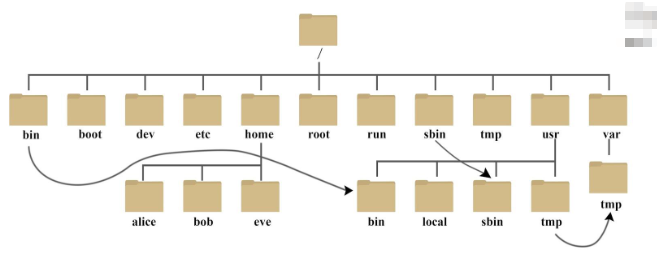
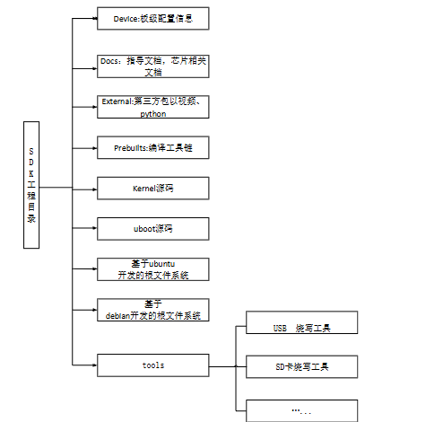

# Linux 环境

## Linux 环境介绍

我们常见的操作系统有`windows`、`linux`、`iOS`还有`Android`。`linux`的发行版除了`ubuntu`，还有`radhat`、`centos`、`debian`、`openwrt`。通常一个嵌入式设备上运行的软件包括`bootloader`，`linux`和`rootfs`。

重点目录：
- bin：存放系统最基本的可执行命令（如 ls、cp）；
- boot：存放系统启动所需的内核和引导文件；
- dev：以文件形式表示硬件设备（如硬盘、终端）；
- etc：存放系统和服务的配置文件；
- mnt：用于临时挂载外部存储设备的挂载点。

## 通用 Linux SDK

一个通用`Linux SDK`工程目录包含有`ubuntu`、`debian`、`app`、`kernel`、`device`、`docs`、`external`等目录。其中一些特性芯片如`RK3308/RV1108/RV1109/RV1126`等，会有所不同。

下载 RK_SDK 后，